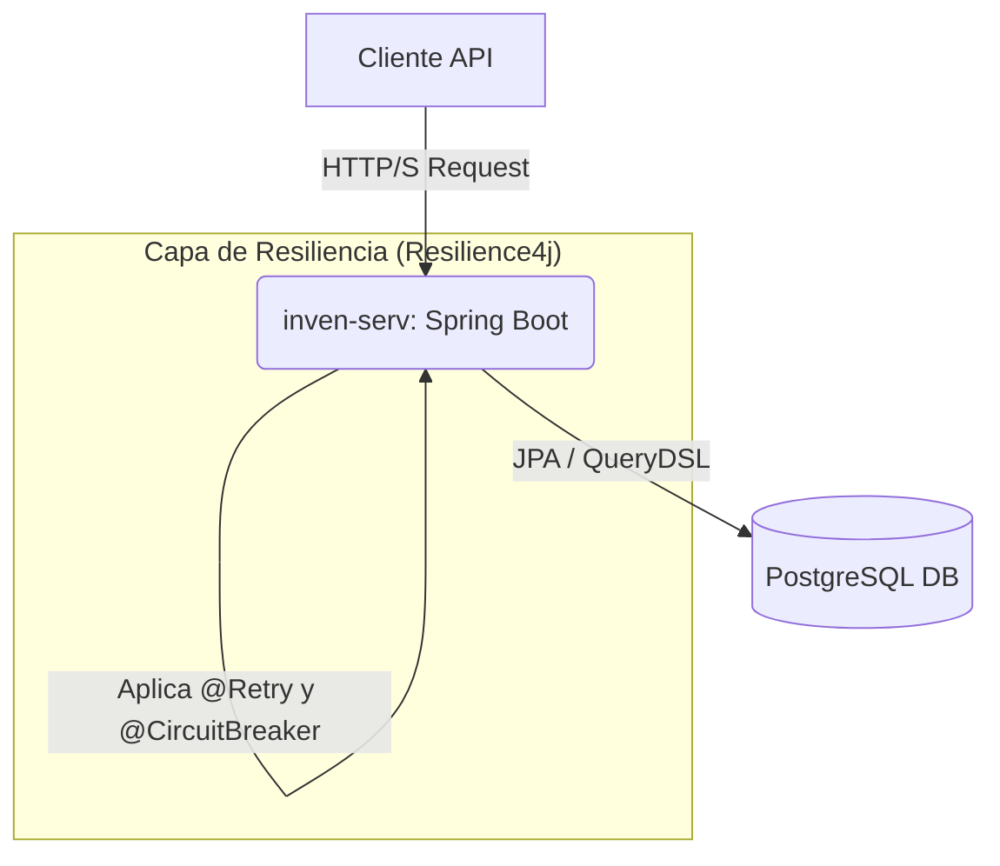

# Inventory Service (inventory-service)

## Introducción

**inven-serv** es un servicio backend RESTful construido con Java y Spring Boot, diseñado para gestionar el inventario de productos de forma robusta y concurrente. El servicio implementa patrones de resiliencia para garantizar una alta disponibilidad y consistencia de datos bajo cargas de trabajo intensas, como pueden ser ventas masivas (flash sales) o actualizaciones simultáneas.

## Características Principales

- **Gestión de Concurrencia Avanzada:** Utiliza bloqueo optimista (`@Version`) para manejar actualizaciones simultáneas de stock de forma segura, previniendo la corrupción de datos.
- **Reintentos Automáticos:** Configurado con **Resilience4j** para reintentar automáticamente las transacciones que fallan debido a colisiones de concurrencia (`OptimisticLockingFailureException`).
- **Tolerancia a Fallos (Circuit Breaker):** Implementa el patrón *Circuit Breaker* para aislar fallos en la conexión con la base de datos, permitiendo que el servicio ofrezca respuestas degradadas (ej. una lista vacía) en lugar de fallar por completo.
- **Consultas de Lectura Eficientes:** Emplea **QueryDSL** para generar proyecciones de solo lectura (`ProductSummary`), asegurando que solo se transfieran los datos necesarios desde la base de datos y mejorando significativamente el rendimiento.
- **Lógica de Dominio Encapsulada:** Sigue principios de *Domain-Driven Design* (DDD) al centralizar la lógica de negocio (ej. `removeStock`) dentro de las propias entidades, promoviendo un código más limpio y mantenible.
- **Auditoría Automática:** Registra automáticamente las fechas de creación y última modificación de todas las entidades gracias a `spring-data-jpa-auditing`.
- **Pruebas de Integración Robustas:** Incluye una suite de pruebas que utiliza **Testcontainers** para validar la lógica contra una instancia real de PostgreSQL, garantizando que el comportamiento en producción sea el esperado.

## Arquitectura del Sistema

El proyecto sigue una arquitectura monolítica basada en Spring Boot. El servicio expone una API REST que interactúa con una base de datos PostgreSQL para la persistencia de los datos. Los patrones de resiliencia se aplican a nivel de servicio para proteger las interacciones con la base de datos.



## Tecnologías Utilizadas

- **Lenguaje:** Java 17
- **Framework Principal:** Spring Boot 3.4
- **Persistencia:**
    - Spring Data JPA
    - Hibernate
    - QueryDSL (para consultas tipo-seguras)
- **Base de Datos:** PostgreSQL
- **Resiliencia:** Resilience4j
- **Gestor de Dependencias:** Apache Maven
- **Pruebas:**
    - JUnit 5
    - AssertJ
    - Testcontainers
    - H2 (para tests unitarios rápidos)
- **Utilerías:** Lombok

## Documentación de la API

El servicio expone una API RESTful. Los endpoints conceptuales principales son:

- `GET /api/products?search={term}`: Busca productos y devuelve una lista de `ProductSummary`.
- `POST /api/products/{sku}/decrease-stock`: Reduce el stock de un producto específico.

Para obtener una documentación interactiva y visual (Swagger UI), se puede añadir la siguiente dependencia al `pom.xml`:

```xml
<dependency>
    <groupId>org.springdoc</groupId>
    <artifactId>springdoc-openapi-starter-webui</artifactId>
    <version>2.5.0</version>
</dependency>
```

Una vez agregada, la documentación estará disponible en la ruta `/swagger-ui.html` al iniciar la aplicación.